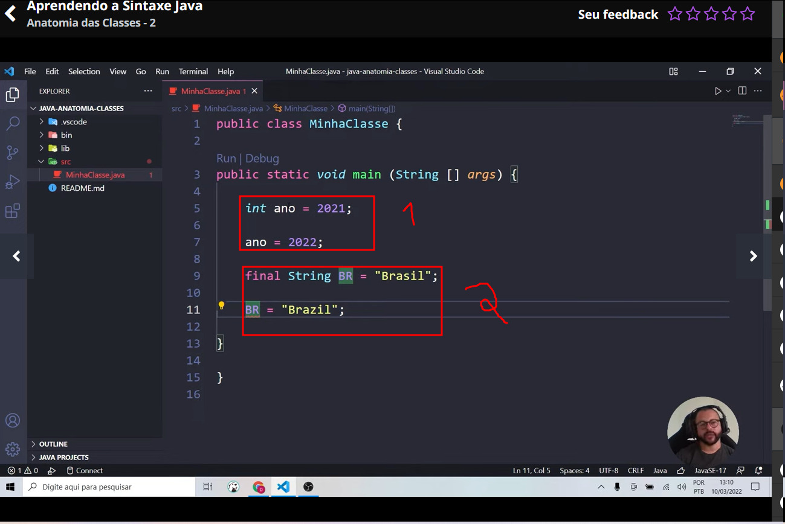
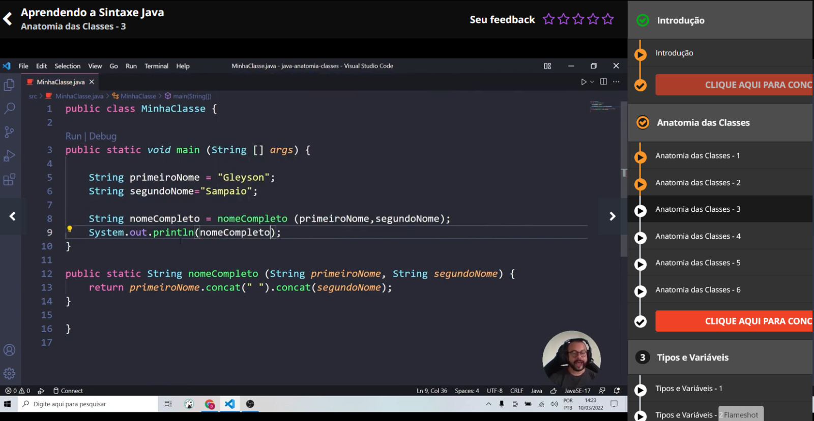
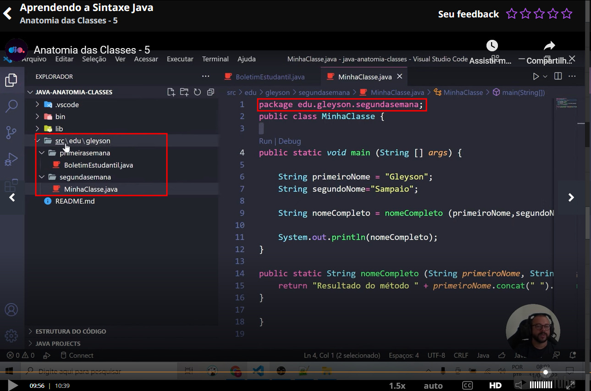

# Sobre este documento

Neste documento irei colocar por aqui tudo o que eu for vendo e anotando de importante sobre a linguagem Java, e também deixarei anotado em um caderno, para que assim fique mais tranquilo de buscar as informações em ambos os lugares de mais fácil acesso a elas. E talvez eu faça em tópicos separados em vários arquivos de anotação, se caso eu achar melhor!

Aproveite o conteúdo!! 😎

# Java Básico - Documentação
________________________________________________________

## Padrão de Nomenclatura

Quando se trata de escrever códigos na linguagem Java, é recomendado seguir algumas conveções de escrita. Esses padrões estão expressos nos itens abaixo:

- <b>Arquivo .java</b>: Todo arquivo .java deve começar com letra MAIÚSCULA. Se a palavra for composta, a segunda palavra deve também ser maiúscula, por exemplo:

    - Calculadora.java,  CalculadoraCientifica.java

- <b>Nome da classe no arquivo</b>: A classe deve possuir o mesmo nome do "arquivo.java", exemplo:

    ```Java
    // arquivo CalculadoraCientifica.java

    public class CalculadoraCientifica{

    }
    ```
- <b>Nome da variável</b>: Toda variável deve ser escrita com letra minúscula, porém se a palavra for composta, a primeira letra da segunda palavra deverá ser MAIÚSCULA, exemplo: ano e anoFabricacao. O nome dessa prática para nomear variáveis dessa forma se chama "camelCase". 

>:bulb: Existe uma regra adicional para as variáveis quando na mesma queremos identificar que ela não sofrerá alteração de valor, exemplo: queremos determinar que uma variável de nome **br** sempre representará **"Brasil"** e nunca mudará seu valor, logo, determinamos como escrita o código abaixo:


```Java
String BR = "Brasil"
double PI = 3.14
int estados_brasileiros = 27
int ano_2000 = 2000
```



>:memo: No primeiro exemplo entendemos de que uma variável normal ela pode sofrer alteração de valor posteriormente.

>:memo: Já no exemplo 2 entendemos de que quando temos uma variável em maiúscula ela não poder sofrer alteração, pois meio que vc declarou ela como se fosse uma constante. E para definirmos também uma variável para que não seja alterado o valor é colocado o **"final"** na frente do tipo da variável que foi criada.

>:warning: **Recomendações: Para declarar uma varíavel nós podemos utilizar caracteres, números e símbolos, porém devemos seguir algumas regras da linguagem, como vemos abaixo:**

- Deve conter apenas letros, _(underline), & ou os números de 0 a 9;
- Deve obrigatoriamente se iniciar por uma letra (preferencialmente), _ ou $, jamais com um número;
- Deve iniciar com uma letra minúscula (boa prática - ver abaixo);
- Não pode contes espaços;
- Não podemos usar palavras-chave da linguagem;
- O nome deve ser único dentro de um espaço.

Como neste exemplo de código abaixo:

```Java
int numero&um = 1; //Os únicos símbolos permitidos são _ e $
int 1numero = 1; //Não pode começar com um número
int numero um = 1; //Não pode conter espaços
int long = 1 //Não pode pois long é uma palavra reservada


//Declaração valida exemplo
int numero$um = 1;
int numero1 = 1;
int numeroum = 1;
int longo = 1;
```
------------------------------

## Declarando Variáveis e Métodos

Como identificar entre declaração de variáveis e métodos em nosso programa? Existe uma estrutura comum para ambas as finalidades, exemplo:

- Declarar uma variável em Java segue sempre a seguinte estrutura:

```Java
Tipo NomeBemDefinido = Atribuição 

//Exemplo
int idade = 23;
double altura = 1.62;
```

- Declarando métodos em Java segue uma estrutura bem simples:

```Java
TipoRetorno NomeObjetivoNoInfinitivo Parametro(s)

//Exemplo

int somar(int numeroUm, int numero2)

String formatarCep (long cep)
```


>:memo: Como neste  exemplo adicionamos os nomes e utilizamos um método que tem como função juntar o primeiro e o segundo nome neste exemplo, onde com isso, o nosso método é chamado na main principal do código, e é bem semelhante as funções e procedimentos que criamos na linguagem C, porém com uma pequena mudança de estrutura.

<br>




>:warning: **Os níveis das pastas de onde se localizam os arquivos é chamado pelo comando "package" e os níveis internos das pastas sem ser o da pasta principal, são separadas por pontos ( . ) como visto na imagem acima para representar cada nível/nome de pasta como neste exemplo de código da aula vista. E caso não tenha isso especificado dentro do arquivo ele já irá dar um erro de compilação.**

-------------------------------

## Java Beans