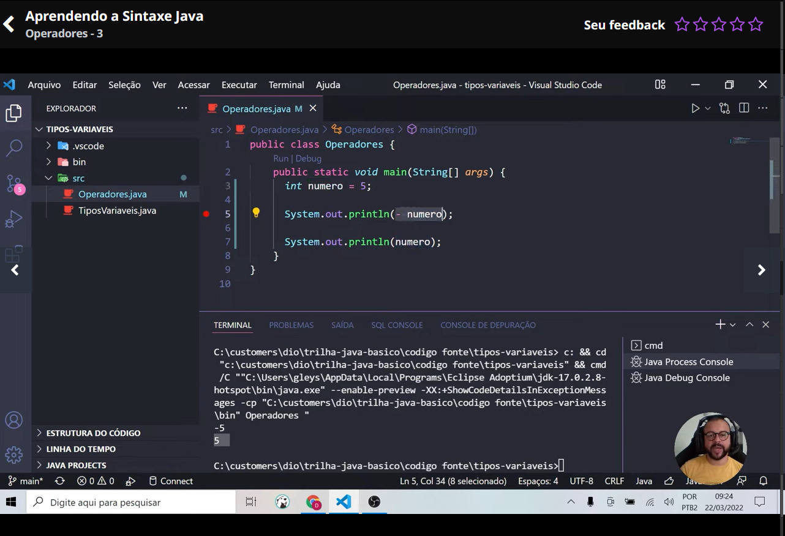
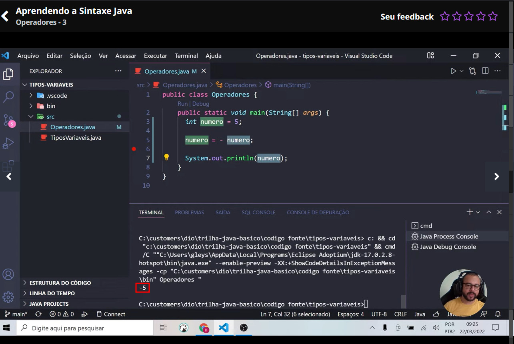
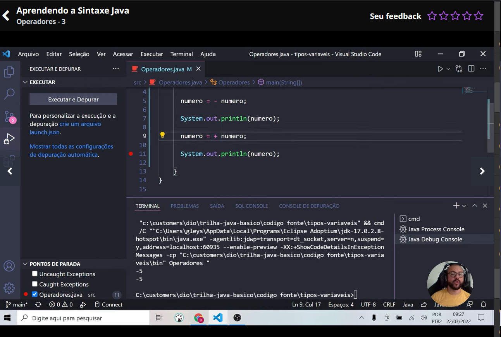
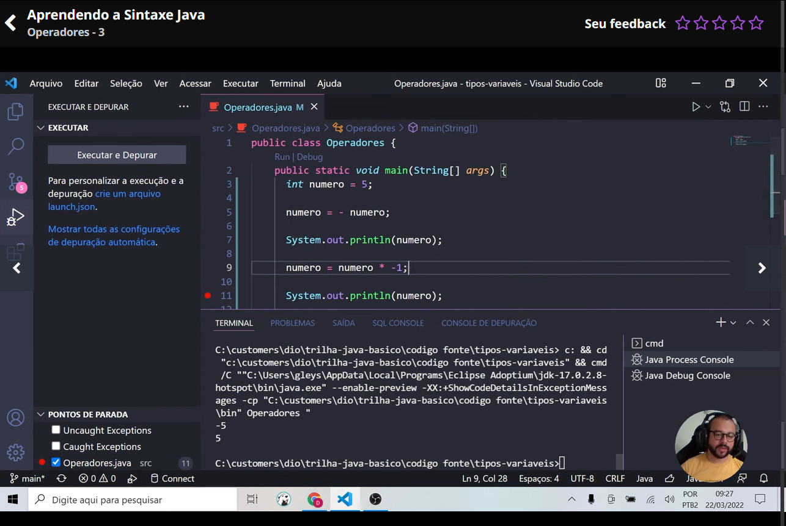
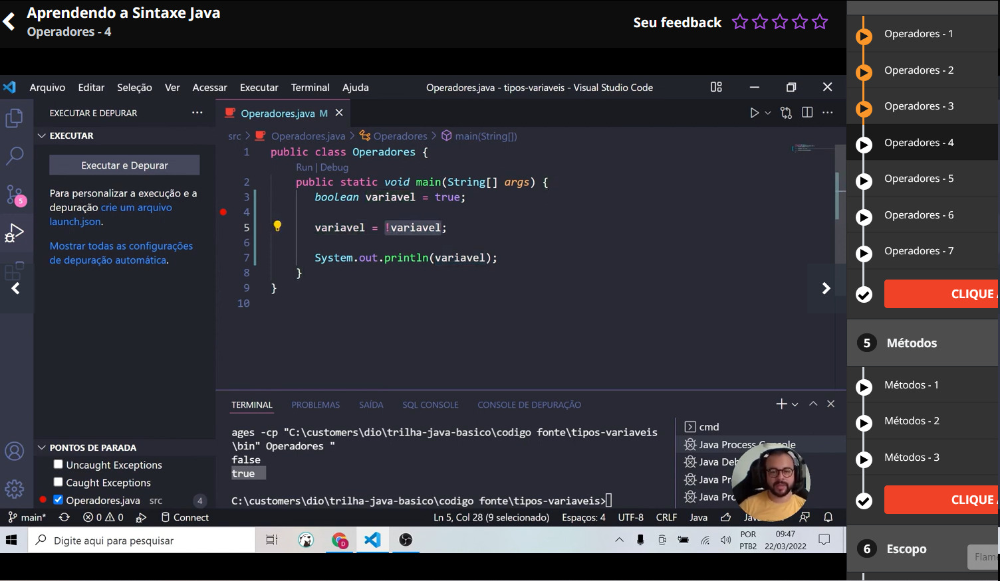

# Sobre este documento

Neste documento irei colocar por aqui tudo o que eu for vendo e anotando de importante sobre a linguagem Java

Aproveite o conteúdo!! 😎

# Java Básico - Documentação
________________________________________________________

## Padrão de Nomenclatura

Quando se trata de escrever códigos na linguagem Java, é recomendado seguir algumas conveções de escrita. Esses padrões estão expressos nos itens abaixo:

- <b>Arquivo .java</b>: Todo arquivo .java deve começar com letra MAIÚSCULA. Se a palavra for composta, a segunda palavra deve também ser maiúscula, por exemplo:

    - Calculadora.java,  CalculadoraCientifica.java

- <b>Nome da classe no arquivo</b>: A classe deve possuir o mesmo nome do "arquivo.java", exemplo:

    ```Java
    // arquivo CalculadoraCientifica.java

    public class CalculadoraCientifica{

    }
    ```
- <b>Nome da variável</b>: Toda variável deve ser escrita com letra minúscula, porém se a palavra for composta, a primeira letra da segunda palavra deverá ser MAIÚSCULA, exemplo: ano e anoFabricacao. O nome dessa prática para nomear variáveis dessa forma se chama "camelCase". 

>:bulb: Existe uma regra adicional para as variáveis quando na mesma queremos identificar que ela não sofrerá alteração de valor, exemplo: queremos determinar que uma variável de nome **br** sempre representará **"Brasil"** e nunca mudará seu valor, logo, determinamos como escrita o código abaixo:


```Java
String BR = "Brasil"
double PI = 3.14
int estados_brasileiros = 27
int ano_2000 = 2000
```


>:memo: No primeiro exemplo entendemos de que uma variável normal ela pode sofrer alteração de valor posteriormente.

>:memo: Já no exemplo 2 entendemos de que quando temos uma variável em maiúscula ela não poder sofrer alteração, pois meio que vc declarou ela como se fosse uma constante. E para definirmos também uma variável para que não seja alterado o valor é colocado o **"final"** na frente do tipo da variável que foi criada.

>:warning: **Recomendações: Para declarar uma varíavel nós podemos utilizar caracteres, números e símbolos, porém devemos seguir algumas regras da linguagem, como vemos abaixo:**

- Deve conter apenas letros, _(underline), & ou os números de 0 a 9;
- Deve obrigatoriamente se iniciar por uma letra (preferencialmente), _ ou $, jamais com um número;
- Deve iniciar com uma letra minúscula (boa prática - ver abaixo);
- Não pode contes espaços;
- Não podemos usar palavras-chave da linguagem;
- O nome deve ser único dentro de um espaço.

Como neste exemplo de código abaixo:

```Java
int numero&um = 1; //Os únicos símbolos permitidos são _ e $
int 1numero = 1; //Não pode começar com um número
int numero um = 1; //Não pode conter espaços
int long = 1 //Não pode pois long é uma palavra reservada


//Declaração valida exemplo
int numero$um = 1;
int numero1 = 1;
int numeroum = 1;
int longo = 1;
```
------------------------------

## Declarando Variáveis e Métodos

Como identificar entre declaração de variáveis e métodos em nosso programa? Existe uma estrutura comum para ambas as finalidades, exemplo:

- Declarar uma variável em Java segue sempre a seguinte estrutura:

```Java
Tipo NomeBemDefinido = Atribuição 

//Exemplo
int idade = 23;
double altura = 1.62;
```

- Declarando métodos em Java segue uma estrutura bem simples:

```Java
TipoRetorno NomeObjetivoNoInfinitivo Parametro(s)

//Exemplo

int somar(int numeroUm, int numero2)

String formatarCep (long cep)
```


>:memo: Como neste  exemplo adicionamos os nomes e utilizamos um método que tem como função juntar o primeiro e o segundo nome neste exemplo, onde com isso, o nosso método é chamado na main principal do código, e é bem semelhante as funções e procedimentos que criamos na linguagem C, porém com uma pequena mudança de estrutura.

<br>


>:warning: **Os níveis das pastas de onde se localizam os arquivos é chamado pelo comando "package" e os níveis internos das pastas sem ser o da pasta principal, são separadas por pontos ( . ) como visto na imagem acima para representar cada nível/nome de pasta como neste exemplo de código da aula vista. E caso não tenha isso especificado dentro do arquivo ele já irá dar um erro de compilação.**

-------------------------------

## Java Beans

Uma das maiores dificuldades na programação é escrever algoritmos legíveis a níveis que sejam compreendidos por todo seu time ou por você mesmo no futuro. Para isso a linguagem Java sugere, através de conveções, formas de escrita universal para nossas classes, atributos, métodos e pacotes.

#### Variáveis

Mais cedo já aprendemos algumas regras de declaração de variáveis, mas agora iremos conhecer algumas sugestões de nomenclatura:

- Uma variável deve ser clara, sem abreviações ou definição sem sentido;
- Uma variável é sempre no singular, **exceto quando se referir a um array ou coleção**.
- Defina um idioma único para suas variáveis. Se você for declarar variáveis em inglês, defina todas em inglês.

Não recomendado:

```Java
double salMedio = 1500.23
String emails = "aluno@escola.com"
String myName = "JOSEPH"
```

Recomendado:

```Java
double salarioMedio = 1500.23;
String email = "aluno@escola.com";
String [] emails = {"aluno@escola.com", "professor@email.com"};
String meuNome = "JOSEPH" 
```

Os métodos deverão ser nomeados como verbos, através de uma mistura de letras minúsculas e maiúsculas. Em princípio todas as letras que compõem o nome devem ser mantidas em minúsculo, com exceção da primeira letra de cada palavra composta a partir da segunda palavra.

Exemplos sugeridos para nomenclatura de métodos:

```Java
somar(int n1, int n2){}

abrirConexao(){}

concluirProcessamento(){}
```
-----------------------------------------------------------

## Tipos de Variáveis

No Java, existem algumas palavras reservadas para a representação dos tipos de dados básicos que precisam ser manipulados para a construção de programas. Estes tipos de dados são conhecidos como tipos primitivos (Primitive Types).

>:bulb: Os oito tipos primitivos em Java são:
>int, byte, short, long, float, double, boolean e char - Esses tipos não são considerados objetos, e portanto representam valores brutos. Eles são armazenados diretamente na pilha de memória (Memory Stack).

Tabela de Tipos Primitivos e seus valores:

Tipo | Memória | Valor Minímo | Valor Máximo |
---- | --------| ------------ | ------------ |
byte |  1 byte | -128 |         127
short | 2 byte | -32.768 |      32.767
int | 4 bytes   | -2.147.483.648 | 2.147.483.647
long |  8 bytes | -9.223.372.036.854.775.808 |  9.223.372.036.854.775.807

Os tipos primitivos que podem conter partes fracionárias podem ser representados por dois tipos:

Tipo | Memória | Minímo | Máximo | Precisão |
---- | --------| ------------ | ------------ | -------- |
float | 4 bytes |  -3,4028E + 38 | 3,4028E + 38 | 6 – 7 dígitos |
double | 8 bytes | -1,7976E + 308 | 1,7976E + 308 | 15 dígitos |

Apesar de o tipo float ocupar metade da memória consumida do que um tipo double, ele é menos utilizado. Ele sofre de uma limitação que compromete seu uso em determinadas situações: somente mantém uma precisão decimal entre 6 e 7 dígitos.

Atualmente, com os computadores modernos, se tornou desnecessário utilizar os tipos **short** e **byte**, pois não precisamos nos preocupar tanto assim com o espaço de memória reduzido.

Exemplo de código:

```Java
public class TipoDados {
    public static void main(String[] args){
        byte idade = 20;
        short ano = 2024;
        int cep = 21070333;
        long cpf = 98765432109L;
        float pi = 3.14F;
        double salario = 1275.33;
    }
}
```

>:memo: Neste exemplo de código vemos que o tipo **long** depois que for digitado o valor deverá colocar a letra **L** na frente do valor como visto no código acima para indicar para o sistema de que o valor que está vindo mesmo é do tipo long, e isso vale também para o tipo **float**, que é necessário colocar o **F** na frente do valor digitado.

------------------------------------------------------------

## Variáveis e Constantes

Uma variável é uma área de memória, associada a um nome, que pode armazenar valores de um determinado tipo. Um tipo de dado define um conjunto de valores e um conjunto de operações. Java é uma linguagem com rigidez de tipos, diferente de linguagens como JavaScript, onde declarar o tipo da variável não é obrigatório.

No Java utilizamos identificadores que representam uma referência (ponteiro) a um valor em memória, e esta referência pode ser redirecionada a outro valor, sendo portanto esta a causa do nome "variável", pois o valor pode variar.

Já as Constantes são valores armazenados em memória que não podem ser modificados depois de declarados. Em Java, esses valores são representados pela palavra reservada **final**, seguida do tipo.

Por convenção, **Constantes** são sempre escritas em CAIXA ALTA.

Abaixo temos um exemplo explicativo sobre uso de variáveis e constantes:

```Java
public class ExemploVariavel {
	public static void main(String[] args) {
		/*
		 * esta linha é considerada como declaração de variável iniciamos a existência
		 * variavel numero com valor 5 regra: tipo + nome + valor
		 */
		int numero = 5;

		/*
		 * na linha abaixo iremos alterar o valor do varíavel para 10 observe que o tipo
		 * não é mais necessário, pois a variável já foi declarada anteriormente
		 */
		numero = 10;

		System.out.print(numero);
		
		/*
		 * ao usar a palavra reservada final, você determina que jamais
		 * esta variavel poderá obter outro valor;
		 * logo a linha 25 vai apresentar um erro de compilação
		 * isso é considerado uma CONSTANTE na linguagem Java
		 */
		final double VALOR_DE_PI = 3.14;
		
		VALOR_DE_PI=3.15; //Esta linha vai apresentar erro de compilação!
	}
}
```
-------------------------------------------------------------

## Operadores

Os operadores são aqueles já conhecidos como + (adição), - (subtração), / (divisão), * (multiplicação), == (igual), != (diferente), < (menor), > (maior), <= (menor igual), >= (maior igual).

>:warning: **O operador de adição (+), quando utilizado em variáveis do tipo texto, realizará a "concatenação de textos"**.

#### Unários

Esses opredores são aplicados juntamente com um outro operador aritmético. Eles realizam alguns trabalhos básicos como incrementar, decrementar, inverter valores numéricos e booleanos.

- **(+) Operador unário de valor positivo** - números são positivos sem esse operador explicitamente;

- **(-) Operador unário de valor negativo** - nega um número ou expressão aritmética;

- **(++) Operador unário de incremento de valor** - incrementa o valor em 1 unidade;

- **(--) Operador unário de decremento de valor** - decrementa o valor em 1 unidade;

- **(!) Operador unário lógico de negação** - nega o valor de uma expressão booleana;




>:memo: Dessa forma aqui você não estará alterando o número para ser negativo diretamente, como foi visto neste exemplo.

>:memo: Para mudar realmente o tipo do número teria de ser da seguinte forma:



------------------------------------------------



>:memo: Mas lembrando que se você deseja retornar aquele valor para positivo novamente não seria dessa forma que poderia fazer como visto no resultado da compilação de que o número ainda continuou o mesmo sem alterações.
------------------------------------------------




>:memo: A forma correta de tornar ele positivo novamente seria fazendo uma multiplicação para torná-lo positivo novamente como visto neste exemplo acima.
--------------------------------------------------




>:memo: Neste exemplo é a única forma de inverter um valor de variável **booleana**, que explicando sobre este caso, a variável booleana é **true** no primeiro momento e depois colocamos ela como não que seria **!** na frente da variavel, que inverte o valor para **false** neste caso.
--------------------------------------------------

#### Ternário

